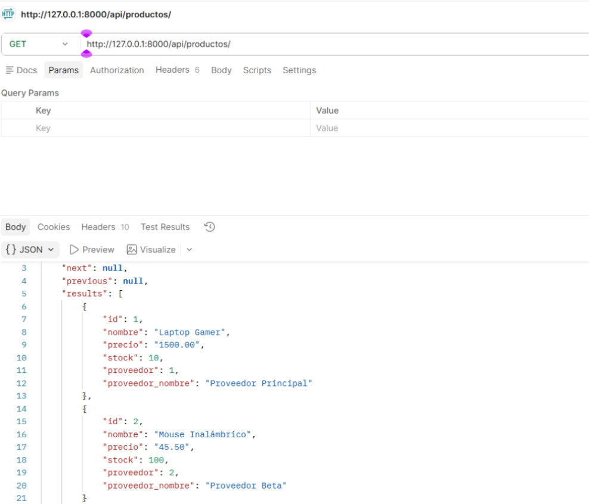
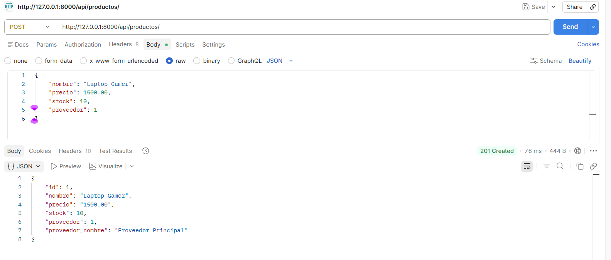
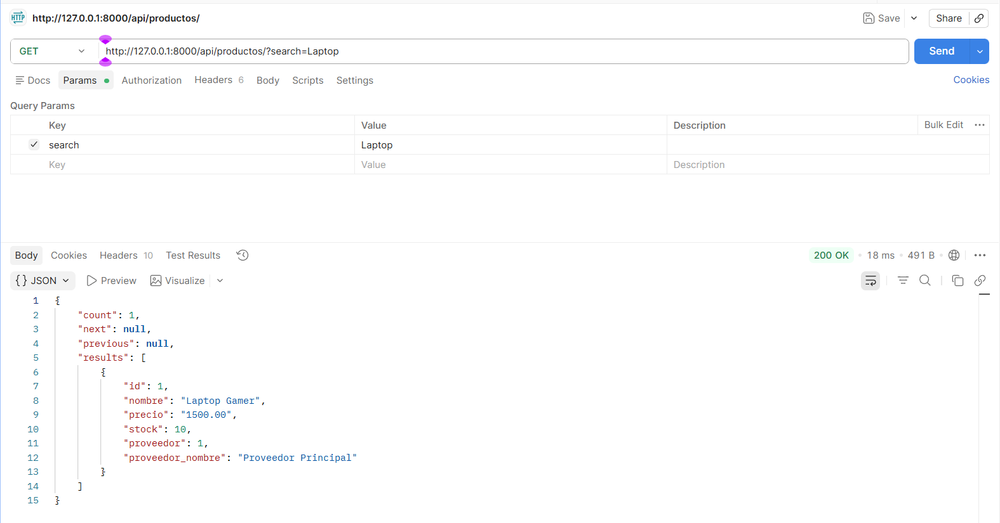
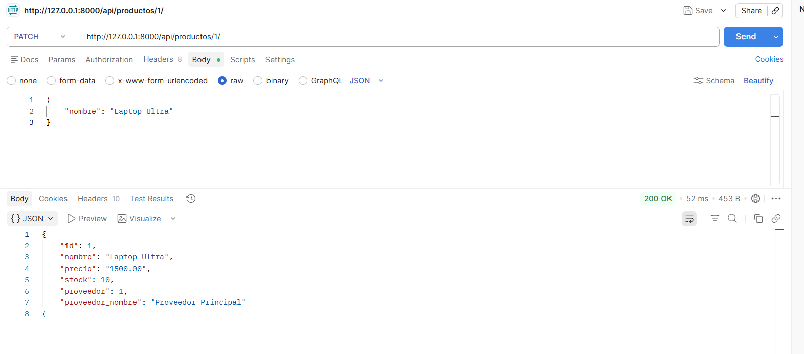
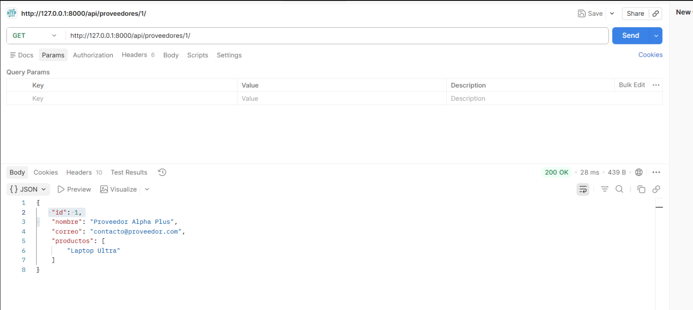
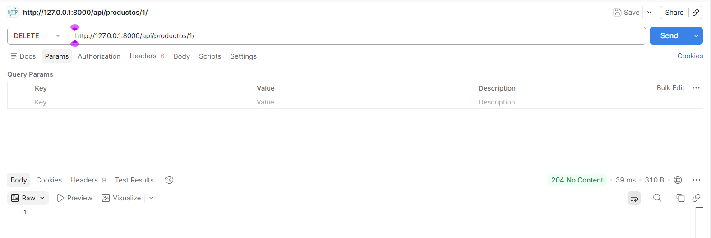
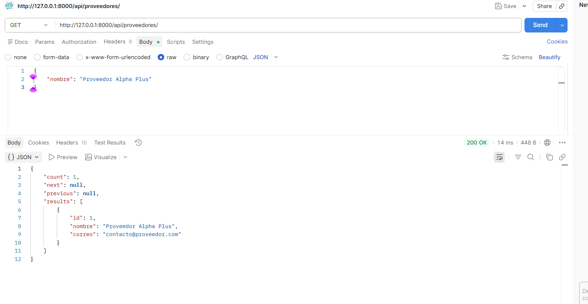
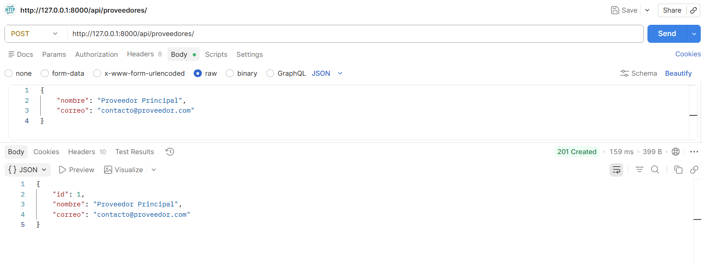
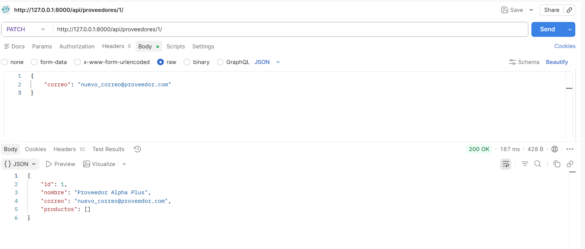
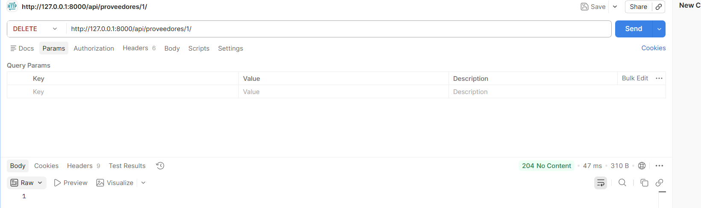

## Gestor de Tienda Online - shopverse_api

Este proyecto es una API RESTful desarrollada con Django y Django REST Framework para la gestión de productos y proveedores en una tienda online.

### Tecnologías utilizadas
- Python 3.13.3
- Django 6.0.3
- Django REST Framework

### Instalación y ejecución
1. Clona el repositorio y navega a la carpeta del proyecto.
2. Crea y activa un entorno virtual:
	```bash
	python -m venv venv
	venv\Scripts\activate  # En Windows
	```
3. Instala dependencias:
	```bash
	pip install -r requirements.txt
	```
4. Ejecuta migraciones:
	```bash
	python manage.py makemigrations productos
	python manage.py migrate
	```
5. Crea un superusuario (opcional, para admin):
	```bash
	python manage.py createsuperuser
	```
6. Inicia el servidor:
	```bash
	python manage.py runserver
	```

### Endpoints principales

| Endpoint                | Descripción                  |
|-------------------------|------------------------------|
| `/api/productos/`       | CRUD de productos            |
| `/api/proveedores/`     | CRUD de proveedores          |

#### Ejemplos de uso (cURL)

**Listar productos:**

curl -X GET http://localhost:8000/api/productos/

**Crear producto:**

curl -X POST http://localhost:8000/api/productos/ 

**Buscar productos por nombre:**
curl -X GET "http://localhost:8000/api/productos/?search=Laptop"


**editar_producto**

**Relacion entidad2 con entidad1**
curl -X GET http://localhost:8000/api/productos/1/


**eliminar produto con id :1**
curl -X DELETE http://localhost:8000/api/productos/1/



**Listar proveedores:**

curl -X GET http://localhost:8000/api/proveedores/


**Crear proveedor:**
curl -X POST http://localhost:8000/api/proveedores/ 

**Usando PATCH**

**Eliminando**

### Tabla de funcionalidades


| Funcionalidad                        | Cumplimiento | Captura sugerida                      |
|--------------------------------------|--------------|---------------------------------------|
| Listado de productos                 | ✅           | screenshots/01_listado_productos.png  |
| Creación de producto                 | ✅           | screenshots/02_crear_producto.png      |
| Edición de producto                  | ✅           | screenshots/03_editar_producto.png     |
| Eliminación de producto              | ✅           | screenshots/04_eliminar_producto.png   |
| Búsqueda de productos (por nombre)   | ✅           | screenshots/05_busqueda_producto.png   |
| Relación producto-proveedor          | ✅           | screenshots/06_relacion_producto.png   |
| CRUD de proveedores                  | ✅           | screenshots/07_crud_proveedor.png      |

> **Nota:** Las capturas deben guardarse en la carpeta `screenshots/` con los nombres indicados.

### Comandos útiles

```bash
# Crear migraciones y migrar
python manage.py makemigrations productos
python manage.py migrate

# Correr el servidor
python manage.py runserver

# Crear datos de prueba en el shell
python manage.py shell
```
En el shell interactivo de Django:
```python
from productos.models import Proveedor, Producto
p1 = Proveedor.objects.create(nombre="Proveedor 1", correo="proveedor1@email.com")
p2 = Proveedor.objects.create(nombre="Proveedor 2", correo="proveedor2@email.com")
prod1 = Producto.objects.create(nombre="Laptop", precio=2500.00, stock=10, proveedor=p1)
prod2 = Producto.objects.create(nombre="Mouse", precio=50.00, stock=100, proveedor=p2)
```

### Guía de commits y subida a GitHub

1. Inicializa el repositorio (si no lo hiciste):
	```bash
	git init
	git remote add origin https://github.com/usuario/tu-repo.git
	```

**LINK DE PRUEBA IMPORTANTE!!!**
https://youtu.be/wAaae3XE4bg

**Recuerda:**
- Reemplaza los archivos antiguos por los nuevos.
- Realiza migraciones y pruebas antes de grabar el video.
- Usa Postman o cURL para demostrar cada funcionalidad.
